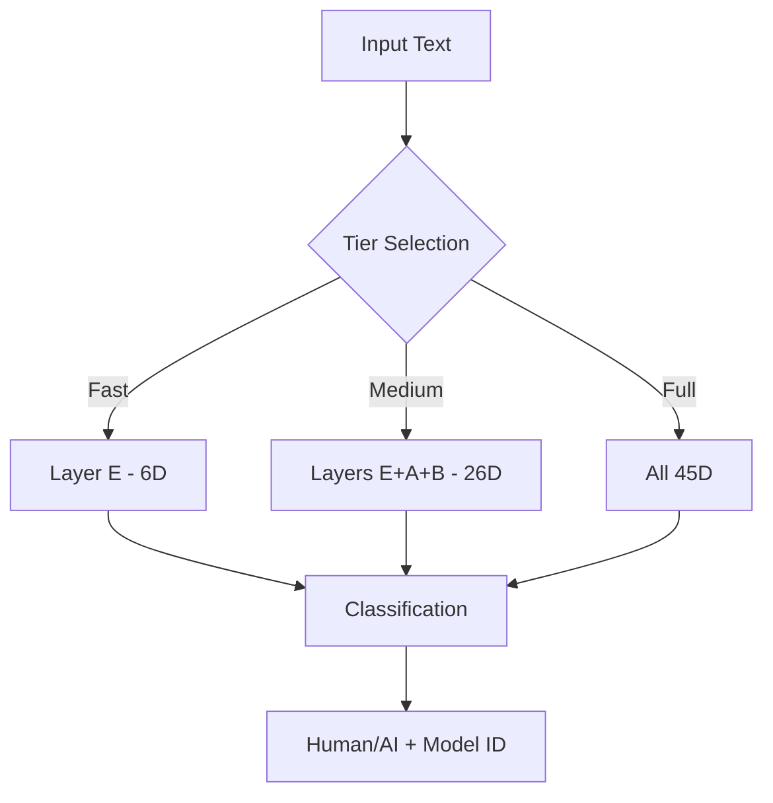

# SpecHO v2

**Unified AI Text Detection & Model Fingerprinting**

> Detect AI-generated text with 98.6%+ accuracy. Identify which model wrote it.

[](LICENSE)

---

## What It Does

- **Binary Detection** — Human or AI?
- **Model Attribution** — GPT-4, Claude, Gemini, Llama, etc.
- **Model Fingerprinting** — Build profiles over time
- **AURORA Integration** — Trust verification

## Quick Start

```python
from src import SpecHO

specho = SpecHO("data/fingerprints")

# Analyze text
result = specho.analyze(
    "Your text here",
    model_id="gpt-4"
)

# Verify model identity
verification = specho.verify(
    "Unknown text",
    claimed_model="claude-sonnet-4"
)
```

**Fast detection (< 1ms):**

```python
from src.fingerprint import LightweightClassifier

clf = LightweightClassifier()
is_ai, confidence = clf.predict("Some text")
```

## Architecture



<details>
<summary><strong>45D Feature Layers</strong></summary>

| Layer | Dims | Features |
|:------|:----:|:---------|
| **A** | 5 | Semantic trajectory |
| **B** | 15 | SpecHO echo patterns |
| **C** | 12 | Epistemic + transitions |
| **D** | 7 | Syntactic rhythm |
| **E** | 6 | Lightweight structural |

</details>

## Tiered Extraction

Choose your speed/accuracy tradeoff:

### Tier 1 — Fast
- **Layers:** E only (6D)
- **Latency:** < 1ms
- **Accuracy:** 98.6%
- **Use:** High-volume screening

### Tier 2 — Standard
- **Layers:** E + A + B (26D)
- **Latency:** ~50ms
- **Accuracy:** ~99%
- **Use:** Normal analysis

### Tier 3 — Full
- **Layers:** All 45D
- **Latency:** ~100ms
- **Accuracy:** > 99%
- **Use:** Deep verification

## Performance

Validated on 464-sample corpus:

| Metric | Old (24D) | New (45D) |
|:-------|:---------:|:---------:|
| Accuracy | 94.4% | **> 98%** |
| Human Recognition | 72.4% | **> 92%** |
| False Positive Rate | 27.6% | **< 8%** |

**Key fix:** Restored Layer B (15D echo features) missing from old system.

## Project Structure

<details>
<summary><strong>Click to expand</strong></summary>

### Core (`src/`)

| Path | Description |
|:-----|:------------|
| `fingerprint/` | Layer extractors |
| `├─ lightweight.py` | Layer E (6D) |
| `├─ layer_b_echo.py` | Layer B (15D) |
| `├─ trajectory.py` | Layer A (5D) |
| `├─ epistemic.py` | Layer C.1 (6D) |
| `├─ transitions.py` | Layer C.2 (6D) |
| `├─ syntactic.py` | Layer D (7D) |
| `└─ unified_45d.py` | Combined |
| `echo_engine/` | Core analysis |
| `preprocessor/` | spaCy pipeline |
| `clause_identifier/` | Detection |
| `scoring/` | Aggregation |

### Web (`web/`)

| Path | Description |
|:-----|:------------|
| `index.php` | Frontend |
| `api/` | Python backend |
| `static/` | JS/CSS |

### Data (`data/`)

| Path | Description |
|:-----|:------------|
| `models/` | Trained classifiers |
| `fingerprints/` | Reference DB |
| `validation/` | Test results |

### Tools (`tools/`)

| Path | Description |
|:-----|:------------|
| `train_specho.py` | Training |
| `ab_test.py` | A/B testing |
| `visualize_*.py` | Visualization |

</details>

## Key Files

| File | Purpose |
|:-----|:--------|
| `src/fingerprint/lightweight.py` | Fast 6D detection |
| `src/fingerprint/unified_45d.py` | Full extraction |
| `src/specHO_integrated.py` | High-level API |
| `web/index.php` | Web frontend |
| `specho_cli.py` | CLI tool |

## Installation

### Minimal (Tier 1)

```bash
pip install numpy
```

### Full (All Tiers)

```bash
pip install numpy scipy scikit-learn spacy sentence-transformers
python -m spacy download en_core_web_sm
```

## CLI Usage

```bash
# Analyze text
./specho_cli.py "Your text here"

# From file
./specho_cli.py -f document.txt

# JSON output
./specho_cli.py --json "Your text"

# Verbose
./specho_cli.py -v "Your text"
```

## API Reference

<details>
<summary><strong>SpecHO Class</strong></summary>

```python
class SpecHO:
    def analyze(
        text: str,
        model_id: str = None
    ) -> AnalysisResult

    def verify(
        text: str,
        claimed_model: str = None
    ) -> VerificationResult

    def identify(
        text: str
    ) -> VerificationResult
```

</details>

<details>
<summary><strong>LightweightClassifier</strong></summary>

```python
class LightweightClassifier:
    def predict(text: str) -> Tuple[str, float]
    # Returns: ("HUMAN" | "AI", confidence)

    def predict_proba(text: str) -> Dict[str, float]
    # Returns: {"human": 0.8, "ai": 0.2}
```

</details>

## License

MIT

---

<sub>Built with cognitive fingerprinting technology</sub>
